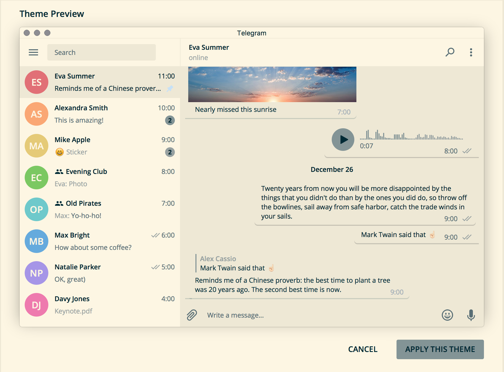

Telegram Solarized Light Theme - Theme for Telegram Desktop

This program is free software; you can redistribute it and/or modify
it under the terms of the GNU General Public License as published by
the Free Software Foundation; either version 3 of the License, or
(at your option) any later version.

This program is distributed in the hope that it will be useful,
but WITHOUT ANY WARRANTY; without even the implied warranty of
MERCHANTABILITY or FITNESS FOR A PARTICULAR PURPOSE.  See the
GNU General Public License for more details.

You should have received a copy of the GNU General Public License
along with this program.  If not, see <http://www.gnu.org/licenses/>.

# About 

Telegram Solarized Light Theme is a theme for Telegram Desktop v1.0 and higher.

# Screenshots

Main screen:

# Install

Install from http://t.me/solarizedlight

# Credits

Thanks [SlavMetal](https://gitlab.com/SlavMetal/telegram-solarized-dark-theme) for his original source code.
